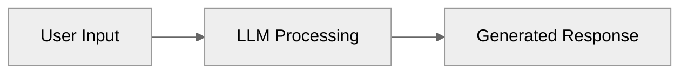
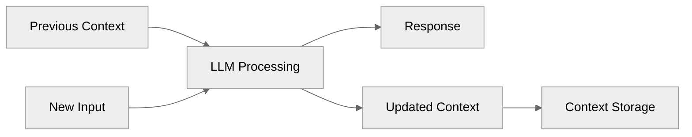
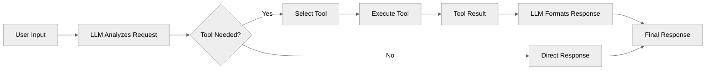
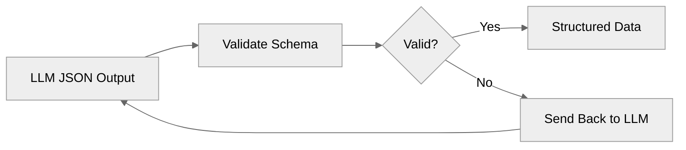
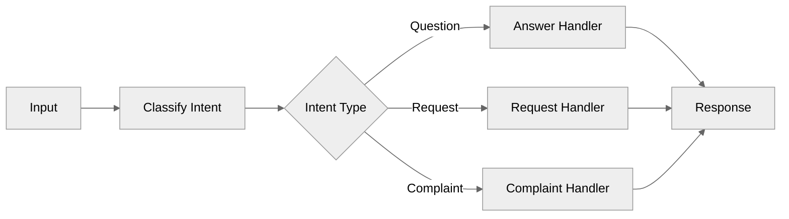
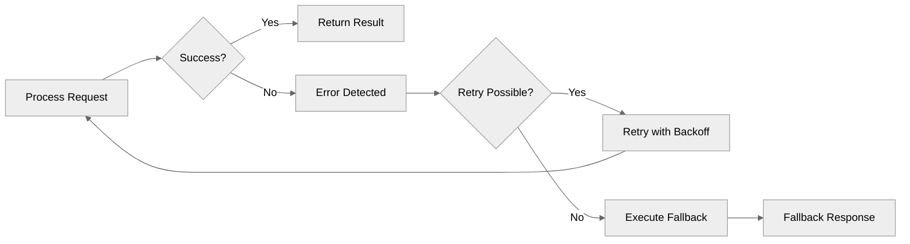
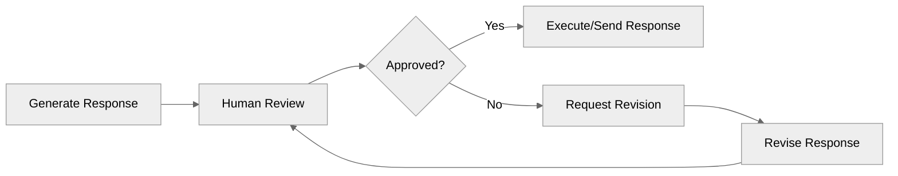

# Fundamentos de Agentes de IA

## Minha experiência prática construindo aplicações de IA reais

Depois de testar vários frameworks de LLM chains e agentes e ter construindo
produtos de IA de verdade, percebi que quase ninguém usa esses frameworks
em produção.

As aplicações de IA que funcionam bem costumam ser feitas com código
próprio, não com frameworks prontos. Isso porque os agentes que realmente
entregam valor não são tão "agentes" assim, são softwares
determinísticos, com chamadas pontuais de LLM nos lugares certos.

Muitos frameworks vendem a ideia de "dar tools para o LLM e deixar ele descobrir tudo". 
Na prática, você não quer que o LLM decida tudo. 
Quer que ele faça o que sabe fazer melhor, `descoberta` com contexto,
enquanto seu código controla o resto.

A solução é mais simples do que parece:

- Quebrar o problema em partes fundamentais

- Resolver cada uma com boas práticas de software

- Chamar o LLM só quando não dá para resolver com código comum

Usar um LLM é caro e pode dar dor de cabeça no fluxo. É útil, mas não deve ser a base de
tudo. Isso é ainda mais crítico em sistemas que rodam em segundo plano, sem um
usuário acompanhando. Lembre-se você não está construindo o próximo ChatGPT, está
criando automações que precisam ser estáveis e eficientes.

E quando chega a hora de usar o LLM, você só precisa passar para ele as
informações certas, no formato certo, no momento certo. Todo o esforço
está em preparar bem esses dados antes da chamada.

## Os fundamentos

No fim, você só precisa de alguns blocos fundamentais para resolver quase
qualquer problema de negócio. Pegue o desafio maior, quebre em partes menores e
resolva cada uma usando esses blocos em sequência. É assim que se constroem
agentes de IA que funcionam de verdade.

Esses blocos são a base. E é aí que entram os [workflows, por meio do
encadeamento de chamadas, roteamento, reflexão e outros padrões](https://www.anthropic.com/engineering/building-effective-agents), você combina
esses blocos estrategicamente e transforma tudo em uma solução prática.

### 1. Inteligência
**O único componente que é "IA"**

É aqui que a mágica acontece e é bem simples. Você envia texto para um LLM, ele
"pensa" sobre, e envia texto de volta. Só isso. **Sem isso, você tem apenas
software regular.** A parte complicada não é a chamada do LLM em si, é todo o
resto que você precisa construir ao redor dela.

### 2. Memória
**Persistência de contexto por meio das interações**

LLMs não se lembram de nada de mensagens anteriores. **Sem memória, cada
interação começa do zero** porque LLMs são stateless. Então você precisa
manualmente passar o histórico da conversa a cada interação. Ou seja é apenas `armazenar
e passar o estado da conversa`, algo que fazemos em aplicações web há muito tempo.

### 3. Tools
**Capacidades de integração com sistemas externos**

Na prática, você não quer que o LLM só fale, você quer que ele aja. Gerar texto
por si só é limitado. O valor real aparece quando o modelo pode disparar ações, como
chamar uma API, atualizar um banco de dados, processar um arquivo.

As tools entram exatamente aí, o LLM decide qual função precisa chamar e
com quais parâmetros, e o seu código executa. No fim, isso nada mais é do que
integração normal de software, a diferença é que um LLM entra para "escolher" a função
e montar o JSON de entrada.

### 4. Validação
**Garantia de qualidade e aplicação de dados estruturados**

Aqui, você precisa garantir que o LLM retorne JSON que corresponda ao seu esquema
esperado. **LLMs são probabilísticos e ~~podem~~ vão produzir saídas inconsistentes**,
então você valida a saída JSON por meio de uma estrutura predefinida. Se a validação
falhar, você pode enviá-la de volta para o LLM corrigir. Isso garante que o
código downstream possa trabalhar de forma confiável com os dados. Isso é apenas
*validação normal de esquema* com lógica de retry usando ferramentas como
[Pydantic](https://docs.pydantic.dev/latest/).

### 5. Controle
**Tomada de decisão determinística e fluxo de processo**

Não! Você não quer que o LLM tome todas as decisões, algumas coisas devem ser
tratadas por código regular. Use declarações `if/else`, `switch cases`, e `lógica de
roteamento` para direcionar o fluxo baseado em condições (não tem problema algum nisso). 
Isso é apenas *lógica de negócio normal e roteamento* que você escreveria em qualquer aplicação.

### 6. Recuperação
**Gerenciamento de falhas**

Uma coisa é certa, **as coisas vão dar errado**. APIs ficarão fora do ar, LLMs retornarão
alucinações, limites de output vão ocorrer. Você precisa de blocos `try/catch`,
lógica de retry com backoff, e respostas de fallback quando as coisas quebram.
Isso é apenas *tratamento padrão de erros* que você implementaria em qualquer
sistema de produção (por algum motivo as pessoas estão esquecendo isso).

### 7. Feedback
**Supervisão humana e fluxos de aprovação**

Às vezes não da para escapar e você precisa de um humano para verificar o
trabalho do LLM antes que ele seja publicado. **Algumas decisões são muito
importantes ou complexas para automação completa**, como enviar um pix para
clientes ou fazer compras. Adicione etapas de aprovação onde humanos podem
revisar e `aprovar/rejeitar` antes da execução. Isso são apenas *fluxos de
trabalho básicos de aprovação* como você construiria para qualquer app.

