# Fundamentos de Agentes de IA

## Minha experiência prática construindo aplicações de IA reais

Depois de testar vários frameworks de LLM chains e agentes e ter construindo
produtos de IA de verdade, percebi que quase ninguém usa esses frameworks
em produção.

As aplicações de IA que funcionam bem costumam ser feitas com código
próprio, não com frameworks prontos. Isso porque os agentes que realmente
entregam valor não são tão "agentes" assim, são softwares
determinísticos, com chamadas pontuais de LLM nos lugares certos.

Muitos frameworks vendem a ideia de "dar tools para o LLM e deixar ele descobrir tudo". 
Na prática, você não quer que o LLM decida tudo. 
Quer que ele faça o que sabe fazer melhor, `descoberta` com contexto,
enquanto seu código controla o resto.

A solução é mais simples do que parece:

- Quebrar o problema em partes fundamentais

- Resolver cada uma com boas práticas de software

- Chamar o LLM só quando não dá para resolver com código comum

Usar um LLM é caro e pode dar dor de cabeça no fluxo. É útil, mas não deve ser a base de
tudo. Isso é ainda mais crítico em sistemas que rodam em segundo plano, sem um
usuário acompanhando. Lembre-se você não está construindo o próximo ChatGPT, está
criando automações que precisam ser estáveis e eficientes.

E quando chega a hora de usar o LLM, você só precisa passar para ele as
informações certas, no formato certo, no momento certo. Todo o esforço
está em preparar bem esses dados antes da chamada.

## Os fundamentos

No fim, você só precisa de alguns blocos fundamentais para resolver quase
qualquer problema de negócio. Pegue o desafio maior, quebre em partes menores e
resolva cada uma usando esses blocos em sequência. É assim que se constroem
agentes de IA que funcionam de verdade.

Esses blocos são a base. E é aí que entram os [workflows, por meio do
encadeamento de chamadas, roteamento, reflexão e outros padrões](https://www.anthropic.com/engineering/building-effective-agents), você combina
esses blocos estrategicamente e transforma tudo em uma solução prática.

### 1. Inteligência
**O único componente que é "IA"**

É aqui que a mágica acontece e é bem simples. Você envia texto para um LLM, ele
"pensa" sobre, e envia texto de volta. Só isso. **Sem isso, você tem apenas
software regular.** A parte complicada não é a chamada do LLM em si, é todo o
resto que você precisa construir ao redor dela.

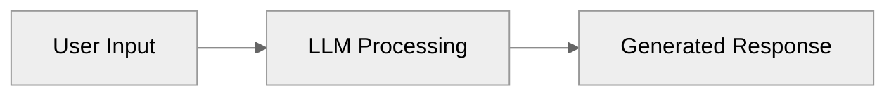

### 2. Memória
**Persistência de contexto por meio das interações**

LLMs não se lembram de nada de mensagens anteriores. **Sem memória, cada
interação começa do zero** porque LLMs são stateless. Então você precisa
manualmente passar o histórico da conversa a cada interação. Ou seja é apenas `armazenar
e passar o estado da conversa`, algo que fazemos em aplicações web há muito tempo.

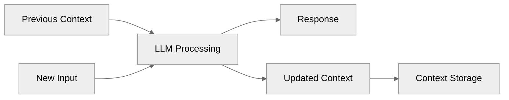

### 3. Tools
**Capacidades de integração com sistemas externos**

Na prática, você não quer que o LLM só fale, você quer que ele aja. Gerar texto
por si só é limitado. O valor real aparece quando o modelo pode disparar ações, como
chamar uma API, atualizar um banco de dados, processar um arquivo.

As tools entram exatamente aí, o LLM decide qual função precisa chamar e
com quais parâmetros, e o seu código executa. No fim, isso nada mais é do que
integração normal de software, a diferença é que um LLM entra para "escolher" a função
e montar o JSON de entrada.

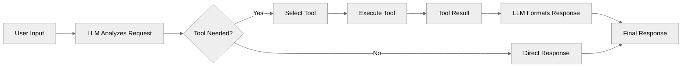

### 4. Validação
**Garantia de qualidade e aplicação de dados estruturados**

Aqui, você precisa garantir que o LLM retorne JSON que corresponda ao seu esquema
esperado. **LLMs são probabilísticos e ~~podem~~ vão produzir saídas inconsistentes**,
então você valida a saída JSON por meio de uma estrutura predefinida. Se a validação
falhar, você pode enviá-la de volta para o LLM corrigir. Isso garante que o
código downstream possa trabalhar de forma confiável com os dados. Isso é apenas
*validação normal de esquema* com lógica de retry usando ferramentas como
[Pydantic](https://docs.pydantic.dev/latest/).

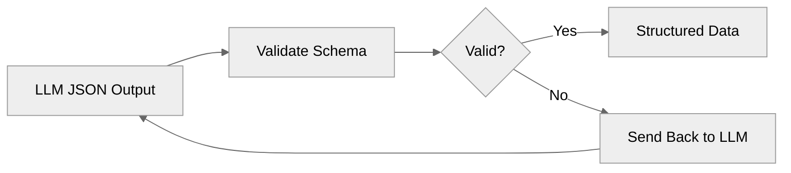

### 5. Controle
**Tomada de decisão determinística e fluxo de processo**

Não! Você não quer que o LLM tome todas as decisões, algumas coisas devem ser
tratadas por código regular. Use declarações `if/else`, `switch cases`, e `lógica de
roteamento` para direcionar o fluxo baseado em condições (não tem problema algum nisso). 
Isso é apenas *lógica de negócio normal e roteamento* que você escreveria em qualquer aplicação.

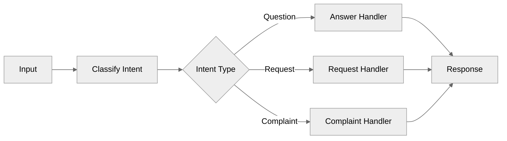

### 6. Recuperação
**Gerenciamento de falhas**

Uma coisa é certa, **as coisas vão dar errado**. APIs ficarão fora do ar, LLMs retornarão
alucinações, limites de output vão ocorrer. Você precisa de blocos `try/catch`,
lógica de retry com backoff, e respostas de fallback quando as coisas quebram.
Isso é apenas *tratamento padrão de erros* que você implementaria em qualquer
sistema de produção (por algum motivo as pessoas estão esquecendo isso).

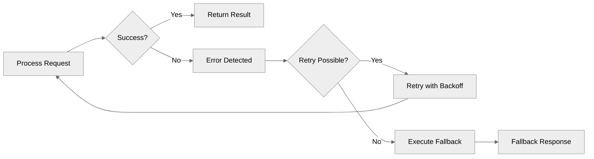

### 7. Feedback
**Supervisão humana e fluxos de aprovação**

Às vezes não da para escapar e você precisa de um humano para verificar o
trabalho do LLM antes que ele seja publicado. **Algumas decisões são muito
importantes ou complexas para automação completa**, como enviar um pix para
clientes ou fazer compras. Adicione etapas de aprovação onde humanos podem
revisar e `aprovar/rejeitar` antes da execução. Isso são apenas *fluxos de
trabalho básicos de aprovação* como você construiria para qualquer app.

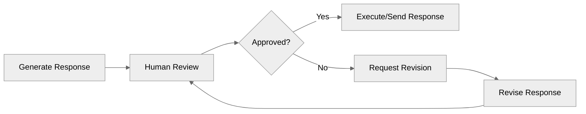

## Padrões de Workflow
Agora um pouco sobre os workflows!

> Os workflows representam uma abordagem estruturada para construir sistemas de
IA que seguem caminhos predefinidos e controlados. Diferentemente dos agentes
totalmente autônomos, os workflows oferecem previsibilidade e consistência
para tarefas bem definidas, enquanto ainda permitem o poder dos modelos de
linguagem para processamento e tomada de decisão.

## Quando usar Workflows vs Agentes
Na maioria das aplicações, workflows são a melhor opção. Eles funcionam bem
quando as tarefas são bem definidas e podem ser divididas em etapas previsíveis,
oferecendo maior controle, menor latência e custos mais estáveis. Já os agentes
fazem sentido quando é necessária maior flexibilidade e decisões guiadas pelo
modelo, principalmente em problemas abertos em que não dá para prever quantas
etapas serão necessárias.

Referência: [Building Effective
Agents](https://www.anthropic.com/research/building-effective-agents)

## Tipos
### Encadeamento de Prompts

O encadeamento de prompts é um padrão que divide tarefas complexas de IA em uma sequência de etapas menores e mais focadas. Cada etapa na cadeia processa a saída da etapa anterior, permitindo melhor controle, validação e confiabilidade.

**Exemplo -**
imagina um assistente de calendário que para funcionar conta com uma cadeia de prompts de 3 etapas com validação:

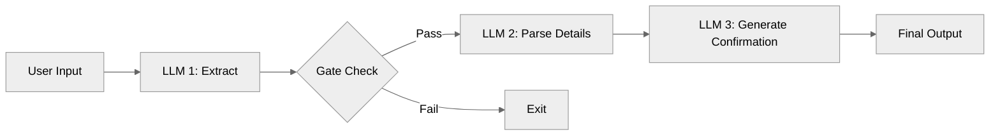

Nesse exemplo, a primeira etapa do processo, chamada de `Extract`, tem como
objetivo principal determinar se a entrada do usuário é realmente uma
solicitação de calendário. Esta etapa fornece um score de confiança que atua
como um filtro inicial para prevenir o processamento de solicitações inválidas.
Isso é necessário para garantir que apenas solicitações relevantes prossigam no
pipeline de processamento.

Na segunda etapa, denominada `Parse Details`, o sistema extrai informações
específicas do calendário e estrutura os dados, incluindo data, hora,
participantes e outros elementos relevantes. Esta etapa é responsável por
converter a linguagem natural em dados estruturados que podem ser processados
pelos sistemas subsequentes, isso garante que todas as informações necessárias
sejam capturadas corretamente.

A terceira e última etapa, `Generate Confirmation`, cria uma mensagem de confirmação
amigável ao usuário. Opcionalmente, esta etapa também pode gerar links de
calendário e fornece a resposta final ao usuário. A ideia aqui é garantir que o
usuário receba feedback claro sobre a ação que foi processada e executada pelo
sistema.

### Roteamento

O roteamento é um padrão que direciona diferentes tipos de solicitações para
rotinas especializadas. Isso permite o processamento otimizado de tipos distintos
de solicitações, mantendo uma separação limpa de responsabilidades.

**Exemplo -** de volta ao nosso assistente de calendário, imagina um roteamento
entre criação de novo evento e modificação de evento:

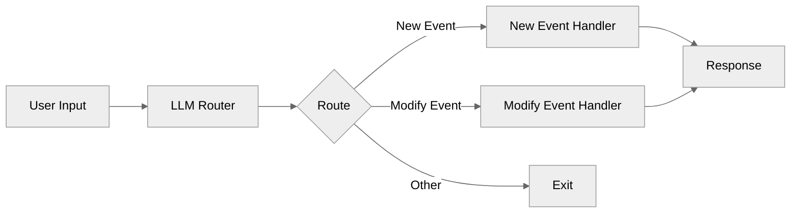

O componente `route` é responsável por classificar o tipo de solicitação,
determinando se o request trata de um novo evento ou modificação de evento
existente. Além de fornecer score de confiança, o roteador também padroniza o
input, garantindo que ele seja direcionado para o fluxo apropriado.

As rotinas especializadas são otimizadas para tarefas específicas. A rotina de `Novo Evento` é especializada na criação de eventos de calendário, enquanto a instrução de `Modificação de Evento` foca no update de eventos existentes. Cada fluxo é otimizado para sua tarefa específica.

### Paralelização

A paralelização executa múltiplas chamadas de LLM simultaneamente para validar ou analisar diferentes aspectos de uma solicitação ao mesmo tempo.

**Exemplo -** ainda no nosso assistente de calendário, imagine que implementamos proteções de validação paralelas:

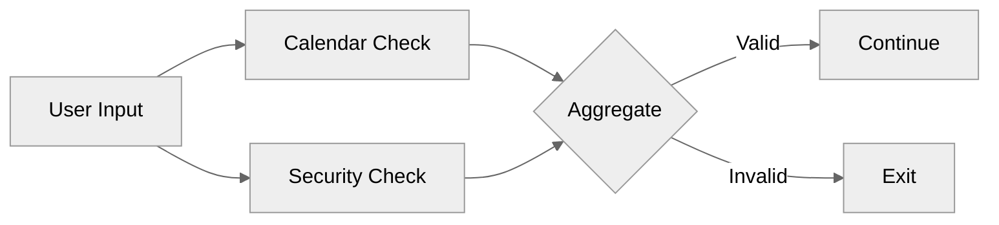

Nesse exemplo, as verificações paralelas incluem a `Validação de Calendário`,
que verifica se a solicitação de calendário é válida, e a `Verificação de
Segurança`, que examina possíveis injeções de prompt. Ambas as chamadas são
executadas simultaneamente para melhor desempenho, isso permite que o sistema
processe múltiplos aspectos da validação sem aumentar de forma agressiva o tempo
de resposta.

A etapa final de agregação combina os resultados de validação de ambas as
chamadas, aplica regras pré-definidas e toma a decisão final de aceitar ou
rejeitar a solicitação. Este processo garante que todas as verificações sejam
consideradas antes de prosseguir com o processamento da solicitação.

### Orquestrador

O padrão **orchestrator-workers** usa um LLM central para analisar dinamicamente
tarefas, coordenar workers especializados e sintetizar seus resultados. Isso
cria um sistema flexível que pode se adaptar a diferentes tipos de solicitações,
mantendo processamento especializado.

**Exemplo -** imagine agora um sistema de escrita de blog que implementa o
padrão de orquestrador para criação de conteúdo:

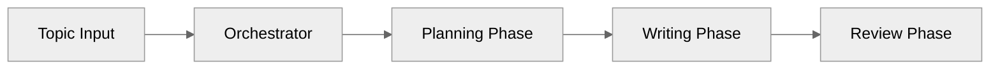

Aqui, o orquestrador é o componente central que analisa o tópico do blog e os
requisitos, cria um plano de conteúdo estruturado, coordena a escrita das seções
e gerencia o fluxo de conteúdo e coesão. Este componente garante que todo o
processo de criação de conteúdo seja coordenado de forma eficiente.

A fase de planejamento analisa a complexidade do tópico e identifica o
público-alvo. Durante esta fase, o conteúdo é dividido em seções lógicas, com
contagem de palavras atribuída por seção e diretrizes de estilo de escrita
definidas.

Já a fase de escrita, workers especializados escrevem seções individuais (aqui
poderia entrar uma paralelização), cada uma mantendo contexto das seções
anteriores. Cada seção segue as diretrizes de estilo e comprimento estabelecidas
na fase de planejamento e captura os pontos-chave definidos para aquela seção
específica.

E finalmente, a fase de revisão avalia a coesão geral do conteúdo e pontua o
fluxo do conteúdo em uma escala de 0 a 1. Durante esta fase, são sugeridas
melhorias específicas para cada seção e é produzida a versão final polida do
conteúdo.

## Conclusão
Acho que deu para perceber como os blocos fundamentais e os workflows se
complementam. Os blocos são as unidades básicas que dão forma a qualquer agente
de IA com inteligência, memória, tools, validação, controle, recuperação e
feedback. Já os workflows entram como a forma de organizar esses blocos em
sequências lógicas, previsíveis e testáveis. É assim que você transforma cada
etapa isolada em um sistema completo que funciona com resultados mais confiáveis.

A construção de agentes de IA de verdade está em combinar fundamentos sólidos
com workflows bem definidos, usar os blocos para resolver cada necessidade
essencial e combinar tudo em um fluxo que faz sentido para o seu caso de uso.

Não tem mágica.